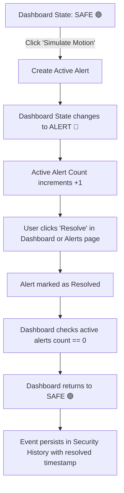
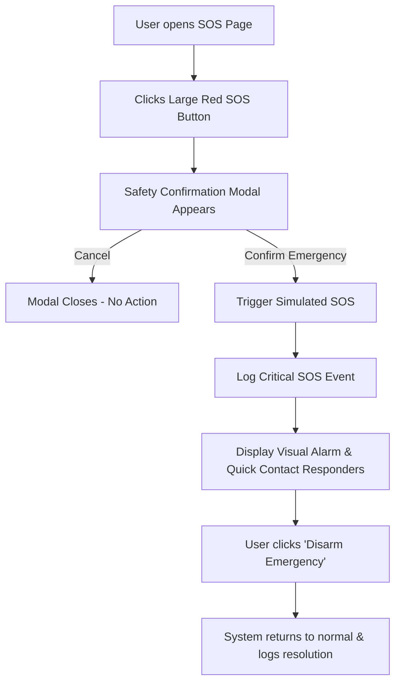

# UI/UX & Architecture Design — Home Security App

**Version:** 1.0  
**Target Stack:** Vanilla HTML5, CSS3, JavaScript (ES6+), LocalStorage  
**Phase:** Phase 1 (Frontend MVP Simulation)  

---

## 1. Project Overview & Aesthetic Direction

The **Home Security App** is an intuitive, responsive web-based security monitoring and simulation dashboard. It gives residents immediate clarity on the security status of their premises (**"Is my home safe right now?"** and **"What happened previously?"**).

### Design Philosophy
* **Clarity & Urgency Hierarchy:** Status is instantly recognizable via high-contrast color badges (🟢 Green / 🔴 Red / 🟡 Amber).
* **Modern Security Aesthetic:** Deep slate/dark-mode compatible palette (`#0f172a`, `#1e293b`, `#3b82f6`, `#ef4444`, `#10b981`), crisp typography (Inter/System sans-serif), clean border radii (8px-12px), subtle shadows, and crisp SVG/Lucide icons.
* **Zero Framework Bloat:** Fast-loading vanilla HTML5, semantic tags, modern CSS custom properties (variables) for effortless light/dark theme switching, and modular vanilla JavaScript.

---

## 2. Design System & Tokens

### Color Palette (CSS Variables)

```css
:root {
  /* Core Theme - Dark (Default Security Look) / Light Mode Toggle */
  --bg-primary: #0f172a;       /* Slate 900 */
  --bg-secondary: #1e293b;     /* Slate 800 */
  --bg-card: #1e293b;          /* Card Background */
  --bg-card-hover: #334155;    /* Slate 700 */
  
  --text-primary: #f8fafc;     /* Slate 50 */
  --text-secondary: #94a3b8;   /* Slate 400 */
  --text-muted: #64748b;       /* Slate 500 */
  
  --border-color: #334155;     /* Slate 700 */
  --border-light: #475569;
  
  /* Status & Accents */
  --color-safe: #10b981;       /* Emerald 500 - SAFE */
  --color-safe-bg: rgba(16, 185, 129, 0.15);
  
  --color-alert: #ef4444;      /* Red 500 - ALERT / DANGER */
  --color-alert-bg: rgba(239, 68, 68, 0.15);
  
  --color-warning: #f59e0b;    /* Amber 500 - WARNING / MEDIUM */
  --color-warning-bg: rgba(245, 158, 11, 0.15);
  
  --color-info: #3b82f6;       /* Blue 500 - INFO / PRIMARY BUTTONS */
  --color-info-bg: rgba(59, 130, 246, 0.15);
  
  /* Typography & Sizing */
  --font-family: 'Inter', -apple-system, BlinkMacSystemFont, 'Segoe UI', Roboto, sans-serif;
  --radius-sm: 6px;
  --radius-md: 10px;
  --radius-lg: 16px;
  --radius-full: 9999px;
  --shadow-sm: 0 1px 2px 0 rgba(0, 0, 0, 0.2);
  --shadow-md: 0 4px 6px -1px rgba(0, 0, 0, 0.3);
  --shadow-lg: 0 10px 15px -3px rgba(0, 0, 0, 0.4);
}

[data-theme="light"] {
  --bg-primary: #f1f5f9;       /* Slate 100 */
  --bg-secondary: #ffffff;     /* White */
  --bg-card: #ffffff;
  --bg-card-hover: #f8fafc;
  
  --text-primary: #0f172a;     /* Slate 900 */
  --text-secondary: #475569;   /* Slate 600 */
  --text-muted: #94a3b8;       /* Slate 400 */
  
  --border-color: #e2e8f0;     /* Slate 200 */
  --border-light: #cbd5e1;
}
```

---

## 3. Page Structure & Component Breakdown

The web application consists of 9 interconnected pages sharing unified navigation and layout templates.

```
┌────────────────────────────────────────────────────────────────────────┐
│ TOP HEADER: App Logo / System Status Pill / Time / User Profile Menu   │
├──────────────┬─────────────────────────────────────────────────────────┤
│ SIDEBAR      │ MAIN CONTENT VIEWPORT                                   │
│              │                                                         │
│ • Dashboard  │  [Page Title & Breadcrumb]   [Action Button]            │
│ • Alerts     │                                                         │
│ • History    │  [Dynamic Metrics / Quick Action Toolbar]               │
│ • SOS        │                                                         │
│ • Contacts   │  [Main Cards / Interactive Tables / Simulation Modals]  │
│ • Profile    │                                                         │
│ • Settings   │                                                         │
│ • Logout     │                                                         │
└──────────────┴─────────────────────────────────────────────────────────┘
```

### 3.1 `index.html` (Login) & `signup.html` (Registration)
* **Purpose:** User authentication gate with validation, password visibility toggle, remember-me, and redirect handling.
* **Layout:** Centered security card with branded emblem, shield illustration, form fields with floating/clean labels, inline validation states, and auth mode switcher.

### 3.2 `dashboard.html` (Command Center)
* **Hero Security Status Banner:** Large pulsing status badge:
  * 🟢 **SAFE** — "All systems normal. No active threats detected."
  * 🔴 **SECURITY ALERT** — "Active breach or alarm detected in [Location]!"
  * Real-time "Last Checked" timestamp & refresh trigger.
* **4 Metric Stat Cards:**
  1. Active Alerts (Dynamic count, red highlight if > 0).
  2. Today's Events (Count of all events logged today).
  3. Resolved Alerts (Count of resolved incidents).
  4. Emergency Contacts (Total trusted responders registered).
* **Quick Simulation Trigger Bar:** 4 one-click trigger buttons:
  * 🏃 Motion Detected (Living Room)
  * 🚪 Door Opened (Main Entrance)
  * 🪟 Window Opened (Master Bedroom)
  * 🚨 Emergency SOS Trigger
* **Recent Activity Feed:** Top 5 latest alerts with direct "Resolve" button and severity tags.

### 3.3 `alerts.html` (Security Alerts Center)
* **Simulation Modal & Action Button:** "+ Simulate New Alert" trigger opening a customizable modal (Event type, location, severity, notes).
* **Filter & Search Bar:**
  * Keyword search (filters location, event name, alert ID).
  * Status filter pills: `All`, `Active`, `Resolved`.
  * Severity dropdown: `All`, `Critical`, `High`, `Medium`, `Low`.
* **Alerts Grid / List:** Interactive cards showing ID, timestamp, location, severity badge, status pill, and action buttons (`Resolve`, `View Details`).

### 3.4 `history.html` (Audit Log & Event History)
* **Purpose:** Permanent, chronological record of all events (alerts created, resolved, SOS triggers).
* **Features:** Search by keyword, filter by date range or event type, status filter, and export/clear simulation history button.
* **Event Table/Timeline:** Clean layout showing date, time, event description, location, severity, and resolution timestamp.

### 3.5 `emergency.html` (SOS Emergency Center)
* **Visual Focus:** Centered pulsating, prominent **SOS Emergency Button**.
* **2-Step Safety Modal:**
  1. First click opens confirmation prompt: *"Are you sure you want to trigger a simulated emergency alert?"*
  2. Confirmation triggers emergency status, logs `CRITICAL_SOS` event, sounds visual alarm banner, and presents emergency contacts for instant mock calling/messaging.
* **Active SOS State:** Prominent "Disarm / Stand Down SOS" button to restore safety.
* **Emergency Dispatch History:** Log of past simulated SOS activations.

### 3.6 `contacts.html` (Trusted Emergency Contacts)
* **Contact Cards Grid:** List of emergency contacts with avatar, name, relationship badge (e.g., *Family, Neighbor, Police*), phone, email.
* **Actions:** Quick "Simulate Call", "Simulate SMS", "Edit Contact", "Delete Contact".
* **Modal:** "+ Add New Contact" and "Edit Contact" with client-side phone/email validation.

### 3.7 `profile.html` (Resident Profile)
* **Profile Header:** Avatar with mock image upload/preview, resident name, and account status.
* **Editable Information Form:** Full name, email, phone number, physical home address, blood group/medical notes, and emergency access codes (mock).
* **Save/Feedback Notifications:** Instant toast feedback upon saving.

### 3.8 `settings.html` (App Preferences)
* **Notification Preferences:** Toggle switches for Security Alerts, Emergency Alarms, Email Notifications, and Audio Sound Effects.
* **Appearance:** Dark Theme / Light Theme switch with instant live update across all pages.
* **Data Management:** "Reset Demo Data / Seed Sample Data" (vital for college presentation resets).
* **Account:** Change Password form and Logout action.

---

## 4. User Flows

### Flow 1: Core Security Demo Flow (Safe → Breach → Resolve → Safe)


### Flow 2: Emergency SOS Trigger Flow


---

## 5. Responsive Behavior

| Viewport | Sidebar | Layout | Tables / Grids |
|---|---|---|---|
| **Desktop (> 1024px)** | Fixed 260px vertical sidebar | 2-column dashboard layout | Multi-column table & 4-column metric grid |
| **Tablet (768px - 1024px)**| Collapsible 80px icon sidebar / sliding drawer | 2-column metrics, stacked alert feed | 2-column metric grid, responsive cards |
| **Mobile (< 768px)** | Off-canvas sliding drawer + Top hamburger bar | 1-column vertically stacked cards | Cards stack vertically, touch-friendly buttons (min 44px tap target) |

---

## 6. Shared Modular JavaScript Architecture

The code will be structured into clean, reusable vanilla JS modules:
1. `storage.js`: Centralized data store wrapper (`localStorage` abstraction) with seed initializers and CRUD helpers for `alerts`, `history`, `contacts`, `profile`, `settings`. This makes Phase 2 Firebase integration a clean drop-in replacement!
2. `ui.js`: Common UI utilities (toast notifications, modal open/close, theme toggling, sidebar toggle, time formatting).
3. `auth.js`: Session management, mock login/logout, route protection (redirect to `index.html` if unauthenticated).
4. `dashboard.js`, `alerts.js`, `history.js`, `emergency.js`, `contacts.js`, `profile.js`, `settings.js`: Page-specific controllers.
